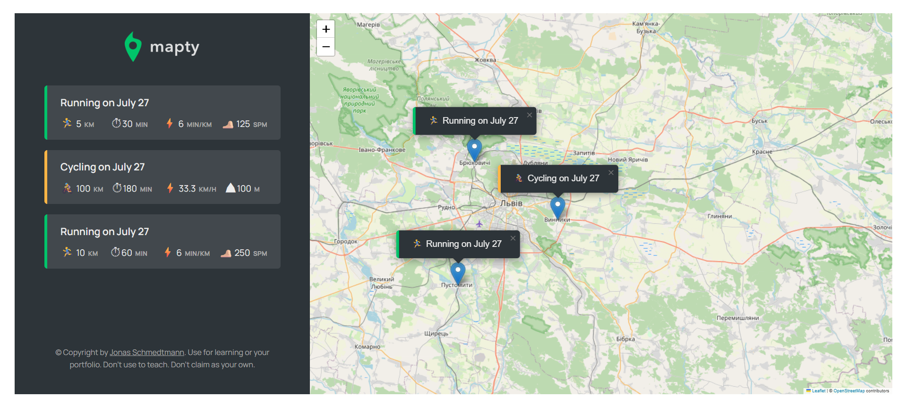

# 🗺️ Mapty — Workout Tracker with Maps

[🔗 Live Demo](https://stasiv-mapty.netlify.app/)

## 📌 About the Project

**Mapty** is a web application that lets users log their running or cycling workouts by clicking on a map.  
It uses **Leaflet.js** for interactive maps and **localStorage** for data persistence — no backend required.  
Built with **JavaScript**, this project showcases OOP, DOM manipulation, geolocation, and third-party library integration.

This app was developed as part of learning modern JavaScript and architecture patterns.

## 🚀 Live Demo

[https://stasiv-mapty.netlify.app/](https://stasiv-mapty.netlify.app/)

## 🧠 Features

- 🧭 Geolocation-based map centered on your current position  
- 📌 Click on the map to log a **running** or **cycling** workout  
- 🧮 Inputs: distance, duration, cadence or elevation  
- 💾 Workouts saved in **localStorage**  
- 🗂️ Data persists across page reloads  
- ✏️ Edit/Delete functionality *(optional to implement)*

## 🛠️ Technologies Used

- **HTML5**
- **CSS3**
- **Vanilla JavaScript (ES6+)**
- **Leaflet.js** for map API
- **Geolocation API**
- **localStorage**

## 📸 Screenshot

  

## ⚙️ How to Run Locally

1. Clone the repo:
   ```bash
   git clone https://github.com/stsvt/mapty.git
